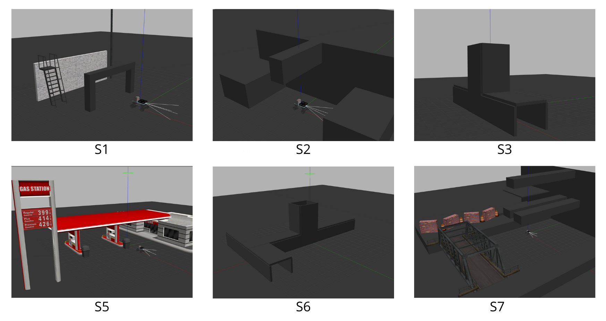
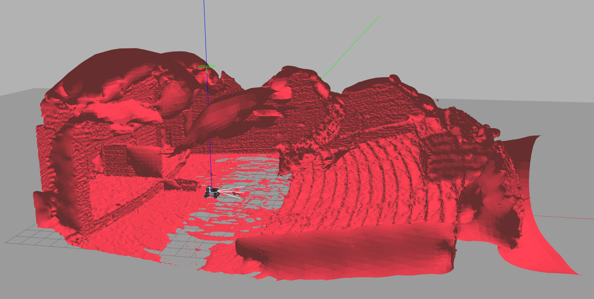

<a id="readme-top"></a>

<!-- PROJECT LOGO -->
<br />
<div align="center">

  <a href="https://github.com/robotics-upo/marsupial-simulator">
    
  </a>

<h3 align="center">Marsupial Simulator</h3>

  <p align="center">
    This is a ROS 2 marsupial system simulator for Gazebo created by the Service Robotics Lab from the Pablo de Olavide University (Spain).
    <br />
  </p>
</div>


<!-- TABLE OF CONTENTS -->
<details>
  <summary>Table of Contents</summary>
  <ol>
    <li>
      <a href="#about-the-project">About The Project</a>
    </li>
    <li>
      <a href="#getting-started">Getting Started</a>
      <ul>
        <li><a href="#prerequisites">Prerequisites</a></li>
        <li><a href="#installation">Installation</a></li>
      </ul>
    </li>
    <li><a href="#usage">Usage</a></li>
    <ul>
        <li><a href="#manual-control">Manual control</a></li>
        <li><a href="#automatic-control">Automatic control</a></li>
      </ul>
    <li><a href="#experiments">Experiments</a></li>
    <li><a href="#modifying the Tether">Modifying the Tether</a></li>
    <li><a href="#roadmap">Roadmap</a></li>
  </ol>
</details>


<!-- ABOUT THE PROJECT -->
## About The Project

This project implements a marsupial robotic system (ugv + uav + tether) in the Gazebo simulation environment for ROS2. The main objective is to create a robust simulation environment to test and validate the behaviour and interaction of the marsupial UAV-UGV system under various conditions and scenarios. Leveraging the capabilities of ROS 2, the simulator facilitates the evaluation of innovative methodologies for the coordinated and autonomous operation of both robots, including the dynamics of the flexible tether that connects them.

<div align="center">
  
</div>

<p align="right">(<a href="#readme-top">back to top</a>)</p>

<!-- GETTING STARTED -->
## Getting Started

This is an example of how you may give instructions on setting up your project locally.
To get a local copy up and running follow these simple example steps.

### Prerequisites

This package has been designed and tested in an x86_64 machine under a Ubuntu 22.04 operating system and ROS2 Humble distribution. The following repositories are required for the implementation of the project:
  - sjtu_drone: (https://github.com/noshluk2/sjtu_drone/tree/ros2, branch: ros2)
  - gazebo_ros_link_attacher: (https://github.com/davidorchansky/gazebo_ros_link_attacher, branch: humble-devel)

### Installation


1. Clone this repository into the `src` directory of your `colcon` workspace. 

2. clones the required dependencies into the `src` directory.

3. Finally compile your workspace using ```colcon build``` 

<p align="right">(<a href="#readme-top">back to top</a>)</p>


<!-- USAGE EXAMPLES -->
## Usage
Six scenarios with different features can be set to use the optimizer. S1: Open environment, S2: Narrow/constrained environment, S3: Confined environment, S5: Open environment, S6: Confined environment, S7: Open environment, as shown in the next figure.

<div align="center">
  
</div>

An extra scenario has been included to replicate the trajectory tracking experiment in a theatre conducted for the Path and Trajectory paper. Uncomment the ```spawn theatre``` line in the ```marsupial_simulation.launch.py``` file to see the theatre model (This can noticeably slow down the simulation on older hardware.). 

<div align="center">
  
</div>

The package has a set of predefined configurations (and completely extendable according to the user's need) that relate to the stage number and initial position number. 


### Manual control
To launch the marsupial system in manual mode just launch the file `launch/marsupial_manual_simulation.launch.py`. The control of the ugv can be done using a remote control (default option) or the keyboard. The uav is controlled by the teleop option. To manage the scenario and initial position predefined is recommended to use the parameters for this launch, `world` and `pos_x`, `pos_y`, `pos_z`. Thus, for example, to use S5 and initial position (3, 1, 0):
1. Launch of the gazebo environment:
	```
	ros2 launch marsupial_simulator marsupial_manual_simulation.launch.py world:=stage_5.world pos_x:=3 pos_y:=1 pos_z:=0
	```
2. In order to control the drone it is necessary to send a message for take-off:
	```
	ros2 topic pub /sjtu_drone/takeoff std_msgs/msg/Empty {} --once
	```
3. Landing message:
	```
	ros2 topic pub /sjtu_drone/land std_msgs/msg/Empty {} --once
	```

### Automatic control
To launch the marsupial system in automatic mode just launch the file `launch/marsupial_simulation.launch.py`. To manage the scenario and initial position predefined is recommended to use the parameters for this launch, `world` and `pos_x`, `pos_y`, `pos_z`. Thus, for example, to use S5 and initial position (3, 1, 0):
1. Launch of the gazebo environment:
	```
	ros2 launch marsupial_simulator_ros2 marsupial_simulation.launch.py world:=stage_5.world pos_x:=3 pos_y:=1 pos_z:=0
	```
2. To start the movement to the defined point:
	```
	ros2 launch marsupial_simulator_ros2 marsupial_to_point.launch.py uav_x:=1.0 uav_y:=2.0 uav_z:=7.0 ugv_x:=5.0 ugv_y:=3.0
	```
3. To change the destination point during simulation:
    - UGV
      ```
	  ros2 topic pub /target_position_ugv geometry_msgs/msg/Pose '{position: {x: 3.0, y: 2.0, z: 0.0}, orientation: {x: 0.0, y: 0.0, z: 0.0, w: 1.0}}' --once
	    ```
    - UAV
      ```
	  ros2 topic pub /target_position_uav geometry_msgs/msg/Pose '{position: {x: 3.0, y: 2.0, z: 7.0}, orientation: {x: 0.0, y: 0.0, z: 0.0, w: 1.0}}' --once
	    ```
4. To record a bag:
    ```
    ros2 bag record /sjtu_drone/gt_pose /sjtu_drone/cmd_vel /ugv_gt_pose /forward_velocity_controller/commands /cable_length /target_position_uav /target_position_ugv /tether_positions
    ```


<p align="right">(<a href="#readme-top">back to top</a>)</p>


### Experiments
To replicate the experiments conducted just launch the file `launch/marsupial_simulation.launch.py` and `launch/marsupial_experiment.launch.py`. It is recommended to perform the experiments in the predefined scenario to increase the efficiency of the simulator.

1. Launch of the gazebo environment:
	```
	ros2 launch marsupial_simulator_ros2 marsupial_simulation.launch.py
	```
2. To start the experiment:
	```
	ros2 launch marsupial_simulator_ros2 marsupial_experiment.launch.py mission:=test1
	```
4. To record a bag: the bag is recorded automatically

The tests carried out are as follows:

- Test 1. The UGV is kept static. UAV ascends and descends N times.
- Test 2. The UAV is kept static. The UGV moves between two points N times.
- Test 3. UAV and UGV move in opposite directions N times.
- Test 4. The test performed inside a theatre mentioned in "Path and Trajectory Planning of a Tethered UAV-UGV Marsupial Robotic System" (https://ieeexplore.ieee.org/document/10207830) is replicated. The length of the tether is calculated as a function of the relative distance between the UAV and the UGV. The test is maintained up to the target point 100.
- Test 5. The test performed inside a theatre is replicated again. In this case, the length of the tether is provided by the test trajectory. The test is maintained up to the target point 100. 

It is possible to modify the `self.tether_coef` value of the `ugv_theter_trajectory_follower.py` script to adjust the behaviour of the tether. The test0 is included for this purpose. This parameter should be changed between 0 and 1 until a realistic result is achieved. 

<p align="right">(<a href="#readme-top">back to top</a>)</p>


<!-- Modifying the Tether -->
## Modifying the Tether

By adjusting these parameters, you can simulate different types of tethers and study their behavior under various conditions. The parameters of the tether connecting the UAV and UGV can be customized through a Jinja file. This file allows you to adjust various physical properties of the tether elements to better suit your simulation needs. 

### How to modify

1. Open the Jinja file located at `models > tether > tether.sdf.jinja`.

2. Adjust the values of the parameters as needed. To increase the size of the tether, it is recommended to focus on increasing the `number_elements` parameter. This will result in a longer tether composed of more segments.

3. Save the changes to the Jinja file.

4. Recompile your workspace if necessary to apply the changes to the simulation.

5. To implement the changes run:
    ```
    python3  ~/marsupial_simulator_ros2/scripts/jinja_gen.py   ~/marsupial_simulator_ros2/models/tether/tether.sdf.jinja ~/marsupial_simulator_ros2/models/tether 
    ```

<p align="right">(<a href="#readme-top">back to top</a>)</p>


<!-- ROADMAP -->
## Roadmap

- [X] Create initial marsupial model (uav + ugv+ tether)
- [X] Develop customizable tether model
- [X] Implement control modes
	- [X] Enable manual control mode for direct operation of the marsupial system using remote control or keyboard inputs
	- [X] Develop an automatic control mode to allow the system to move autonomously to predefined points using ROS 2
- [  ] Improve winch automatic control

See the [open issues](https://github.com/robotics-upo/marsupial-simulator/issues) for a full list of proposed features (and known issues).

<p align="right">(<a href="#readme-top">back to top</a>)</p>


<!-- MARKDOWN LINKS & IMAGES -->
<!-- https://www.markdownguide.org/basic-syntax/#reference-style-links -->
[contributors-shield]: https://img.shields.io/github/contributors/github_username/repo_name.svg?style=for-the-badge
[contributors-url]: https://github.com/JoseMaese
[forks-shield]: https://img.shields.io/github/forks/github_username/repo_name.svg?style=for-the-badge
[forks-url]: https://github.com/github_username/repo_name/network/members
[stars-shield]: https://img.shields.io/github/stars/github_username/repo_name.svg?style=for-the-badge
[stars-url]: https://github.com/github_username/repo_name/stargazers
[issues-shield]: https://img.shields.io/github/issues/github_username/repo_name.svg?style=for-the-badge
[issues-url]: https://github.com/github_username/repo_name/issues
[license-shield]: https://img.shields.io/github/license/github_username/repo_name.svg?style=for-the-badge
[license-url]: https://github.com/github_username/repo_name/blob/master/LICENSE.txt


