<div align="center">

  <a href="https://github.com/robotics-upo/marsupial-simulator-ros2">
    
  </a>

  <h3 align="center">
    <a href="https://arxiv.org/abs/2412.12776" style="text-decoration: none; color: inherit;">
      Physical simulation of Marsupial UAV-UGV Systems Connected by a Variable-Length Hanging Tether
    </a>
  </h3>
</div>

<div align="center">
  José E. Maese, Fernando Caballero, and Luis Merino  
</div>

<br>

<div align="center">
  <a href="https://youtu.be/ZLLDROIaHV0" 
     style="display: inline-block; margin-right: 10px; text-decoration: none; vertical-align: middle;">
    
  </a>
  <a href="https://arxiv.org/abs/2412.12776" 
     style="display: inline-block; text-decoration: none; vertical-align: middle;">
    
  </a>
</div>


## Table of Contents
<details>

1. [Introduction](#introduction)
2. [Marsupial System Simulator using Gazebo](#marsupial-system-simulator-using-gazebo)
   - [Architecture](#architecture)
   - [Models](#models)
3. [Validation Experiments](#validation-experiments)
   - [Tether Model Evaluation](#tether-model-evaluation)
   - [Simulated Scenarios](#simulated-scenarios)
   - [Performance Evaluation](#performance-evaluation)
4. [Installation](#installation)
   - [Dependencies](#dependencies)
   - [Build Instructions](#build-instructions)
5. [Usage](#usage)
   - [Manual Control](#manual-control)
   - [Automatic Control](#automatic-control)
   - [Experiments](#experiments)
6. [Customization](#customization)
   - [How to modify tether model](#how-to-modify-tether-model)
   - [How to include new scenarios](#how-to-include-new-scenarios)
7. [Cite this work](#Cite-this-work)

</details>

## Introduction
This paper presents a simulation framework able of modeling the dynamics of a hanging tether with adjustable length, connecting a UAV to a UGV. The model incorporates the interaction between the UAV, UGV, and a winch, allowing for dynamic tether adjustments based on the relative motion of the robots. The accuracy and reliability of the simulator are assessed through extensive experiments, including comparisons with real-world experiment, to evaluate its ability to reproduce the complex tether dynamics observed in physical deployments. The results demonstrate that the simulation closely aligns with real-world behavior, particularly in constrained environments where tether effects are significant. This work provides a validated tool for studying tethered robotic systems, offering valuable insights into their motion dynamics and control strategies.

<div align="center">
  
</div>

<p align="right">(<a href="#readme-top">back to top</a>)</p>


## Marsupial System Simulator using Gazebo

### Architecture
The marsupial UAV-UGV simulator is built using ROS 2 and Gazebo, integrating multiple core components to simulate tethered robot behavior <a href="#simulator-structure">Fig. 2</a>. Each module plays a specific role, and the system supports both manual and autonomous operation. The main steps are:


- **Model Initialization**: The simulation initializes in Gazebo by spawning the UGV, UAV, and a coiled tether around the winch. The UAV starts on a platform atop the UGV, and the tether is connected to both. ROS~2 modules manage the system’s operation.

- **Trajectory Tracking**: This module enables interaction with the system via two methods: (1) YAML files containing waypoints and reference tether lengths, or (2) real-time ROS messages specifying destinations. The UAV, UGV, and winch adjust dynamically to maintain proper tether slack. The framework supports custom trajectory tracking algorithms and control modules.

- **Controllers**: Each robot has a dedicated controller that executes assigned movements. The UGV controller also manages tether control, adjusting its length as needed. The controllers closely replicate real-world robot behavior but can be modified to accommodate different dynamics. 

- **Evaluation and Data Recording**: An Evaluation Module collects and processes ROS~2 topic data, including UAV/UGV poses and tether length variations. The system compiles key performance metrics such as trajectory accuracy, tether behavior, and system stability, storing the results for further analysis.

<div id="simulator-structure" align="center">
  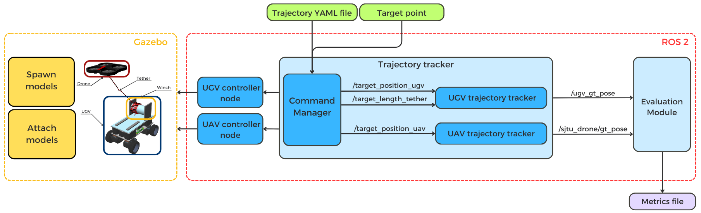
  <p><strong>Figure 2:</strong> Diagram of the Marsupial Simulator. The core modules of simulator are in blue. The base robotics simulator modules are depicted in light yellow color. Green boxes indicate the input data information. Output evaluation metrics are indicated in light purple color.</p>
</div>

The simulator is modular and easily customizable, allowing modifications to the UAV, UGV, and tether models.


### Models
The simulation environment includes models for the UAV, UGV, winch, and tether, ensuring realistic behavior in Gazebo.

- **UAV**: Quadrotor with ROS2-compatible position and velocity control.
- **UGV**: Holonomic ground vehicle with integrated winch.
- **Tether**: Flexible, multi-segmented tether with dynamic length adjustment. Configurable length, mass, and stiffness.

<table id="tether-parameters" style="width:60%; margin: auto; border-collapse: collapse;">
  <thead>
    <tr>
      <th style="text-align: center;">Parameters</th>
      <th style="text-align: center;">Values</th>
      <th style="text-align: center;">Units</th>
    </tr>
  </thead>
  <tbody>
    <tr>
      <td colspan="3" style="text-align: center;"><strong><em>Common Parameters</em></strong></td>
    </tr>
    <tr>
      <td>Radius of each section</td>
      <td style="text-align: center;">0.004</td>
      <td style="text-align: center;">m</td>
    </tr>
    <tr>
      <td>Radius of the joint</td>
      <td style="text-align: center;">0.009</td>
      <td style="text-align: center;">m</td>
    </tr>
    <tr>
      <td>Mass of each section</td>
      <td style="text-align: center;">0.01</td>
      <td style="text-align: center;">kg</td>
    </tr>
    <tr>
      <td>Damping</td>
      <td style="text-align: center;">0.05</td>
      <td style="text-align: center;">Ns/m</td>
    </tr>
    <tr>
      <td>Spring stiffness</td>
      <td style="text-align: center;">0.01</td>
      <td style="text-align: center;">N/m</td>
    </tr>
    <tr>
      <td colspan="3" style="text-align: center;"><strong><em>Coiled Tether Parameters</em></strong></td>
    </tr>
    <tr>
      <td>Number of elements</td>
      <td style="text-align: center;">123</td>
      <td style="text-align: center;">-</td>
    </tr>
    <tr>
      <td>Element length</td>
      <td style="text-align: center;">0.15</td>
      <td style="text-align: center;">m</td>
    </tr>
    <tr>
      <td>Helix radius</td>
      <td style="text-align: center;">0.14</td>
      <td style="text-align: center;">m</td>
    </tr>
    <tr>
      <td colspan="3" style="text-align: center;"><strong><em>Uncoiled Tether Parameters</em></strong></td>
    </tr>
    <tr>
      <td>Number of elements</td>
      <td style="text-align: center;">10</td>
      <td style="text-align: center;">-</td>
    </tr>
    <tr>
      <td>Element length</td>
      <td style="text-align: center;">0.05</td>
      <td style="text-align: center;">m</td>
    </tr>
  </tbody>
</table>

Default parameters such as length, radius, mass, spring stiffness, and damping <a href="#tether-parameters">Table I</a> can be modified as described [here](#modifying-the-tether).

<div id="marsupial-models" align="center">
  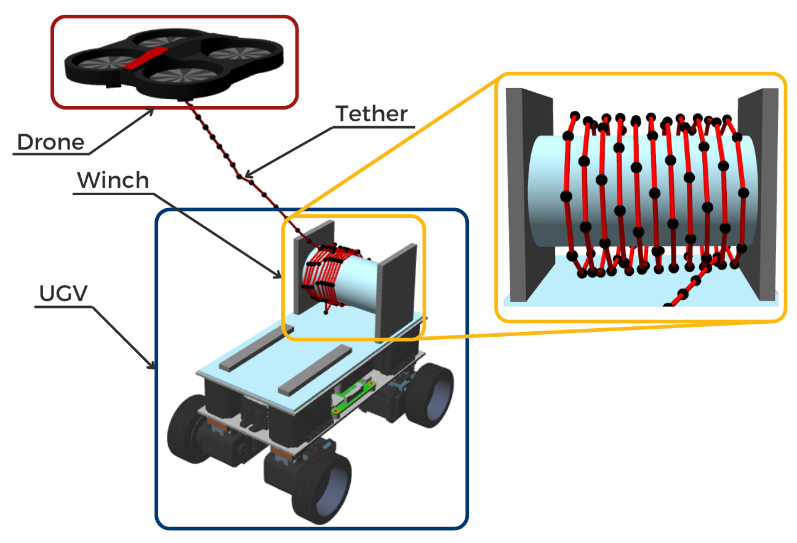
  <p><strong>Figure 3:</strong> Models used in Gazebo simulation.</p>
</div>

Additionally, the tether interacts with obstacles via Gazebo's physics engine, which computes contact forces and tension variations. These interactions affect UAV and UGV dynamics (<a href="#tether-obstacles">Fig. 4</a>). The simulator includes six architectural scenarios to analyze tether behavior under different geometric constraints.

<div id="tether-obstacles" align="center">
  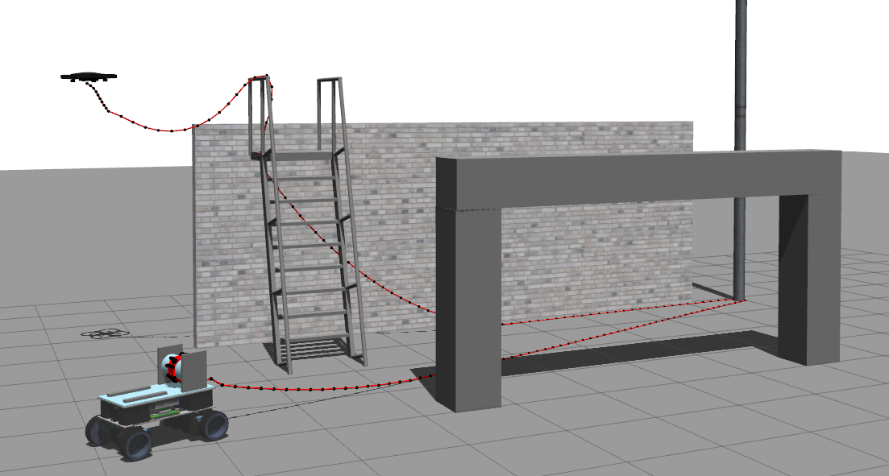
  <p><strong>Figure 4:</strong> Example of tether-obstacle interaction in Gazebo.</p>
</div>

<p align="right">(<a href="#readme-top">back to top</a>)</p>

## Validation Experiments
To evaluate the performance of the simulator and validate its capabilities, we designed a series of scenarios that assess various aspects of the marsupial UAV-UGV system, including stability, tether dynamics, winch operation, and coordination between aerial and ground vehicles under different circumstances. The scenarios are divided into four categories: Tether Model Evaluation, aimed at assessing the accuracy of the simulated tether against a real catenary curve; Simulated Scenarios, focused on testing and verifying the system's general functionalities; Real Scenarios, that replicate real-world experiments to validate the simulator in practical applications; and Performance Evaluation, dedicated to computational efficiency and real-time capabilities of the simulator under different conditions.

### Tether Model Evaluation
To validate the accuracy of the simulated tether against a real catenary, we designed an experiment focusing on the tether's discretization effect. In these experiments, both the UAV and UGV were positioned approximately 5, 10 and 15 meters apart, and the tether length was set to be 20% longer than the Euclidean distance between them to introduce realistic slack.

We simulate the tether using four different lengths of elements: 0.05 m, 0.10 m, 0.15 m and 0.20 m. For each simulation, we recorded the length of each tether element and calculated the averaged error between the positions of the simulated tether elements and those of the theoretical catenary curve under the same conditions. This error measurement provides insights into how the granularity of the tether model influences the simulation's ability to accurately replicate real-world tether dynamics.

<table id="tether-error-table" style="width:80%; margin: auto; border-collapse: collapse;">
  <thead>
    <tr>
      <th style="text-align: center;">Element Length (m)</th>
      <th style="text-align: center;">err_5 (%)</th>
      <th style="text-align: center;">err_10 (%)</th>
      <th style="text-align: center;">err_15 (%)</th>
      <th style="text-align: center;">Mean (%)</th>
    </tr>
  </thead>
  <tbody>
    <tr>
      <td style="text-align: center;">0.05</td>
      <td style="text-align: center;">0.942</td>
      <td style="text-align: center;">0.268</td>
      <td style="text-align: center;">0.269</td>
      <td style="text-align: center;">0.493</td>
    </tr>
    <tr>
      <td style="text-align: center;">0.10</td>
      <td style="text-align: center;">0.332</td>
      <td style="text-align: center;">0.214</td>
      <td style="text-align: center;">0.232</td>
      <td style="text-align: center;">0.259</td>
    </tr>
    <tr>
      <td style="text-align: center;">0.15</td>
      <td style="text-align: center;">0.675</td>
      <td style="text-align: center;">0.323</td>
      <td style="text-align: center;">0.292</td>
      <td style="text-align: center;">0.430</td>
    </tr>
    <tr>
      <td style="text-align: center;">0.20</td>
      <td style="text-align: center;">1.600</td>
      <td style="text-align: center;">0.490</td>
      <td style="text-align: center;">0.552</td>
      <td style="text-align: center;">0.881</td>
    </tr>
  </tbody>
</table>

As shown in <a href="#tether-error-table">Table II</a>, the results indicate that the performance is realistic across all tested cases, with averaged errors below 1\% of the tether length. We can see how, in general, as the length of the element increases, the simulation error with respect to the theoretical model also increases, as expected. However, this effect does not hold when the element length is 0.05 m. We think this behaviour is related with the increase of the simulation complexity, setting Gazebo's solver close to its limits. This is due to the reduced computational load when simulating fewer (longer) elements. 

It is important to note that the region around the winch (highlighted in yellow in <a href="#marsupial-models">Fig. 3</a>) exhibits more chaotical tether dynamics due to the high concentration of elements in a small area. This effect is inherent to the discrete nature of the simulation and cannot be directly controlled, leading to small fluctuations in the tether's appearance near the winch. However, this is purely a visual artifact and does not impact the overall behaviour of the catenary, which remains accurately modeled and is the primary focus of our simulation. Additionally, the winch model used in our simulation does not support tether element lengths greater than 0.2 m due to mechanical constraints. Despite varying the element lengths up to this limit, the precision of the simulation was not affected significantly. This suggests that even with larger element lengths within the supported range, the simulation can maintain a high degree of accuracy in approximating the real catenary curve.


<div id="tether-collision-images" align="center">
  <div style="display: flex; justify-content: center; gap: 20px;">
    <figure>
      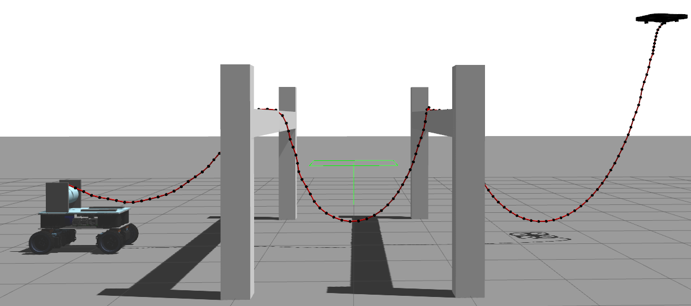
      <figcaption><strong>(a):</strong> Collision with a hanging tether.</figcaption>
    </figure>
    <figure>
      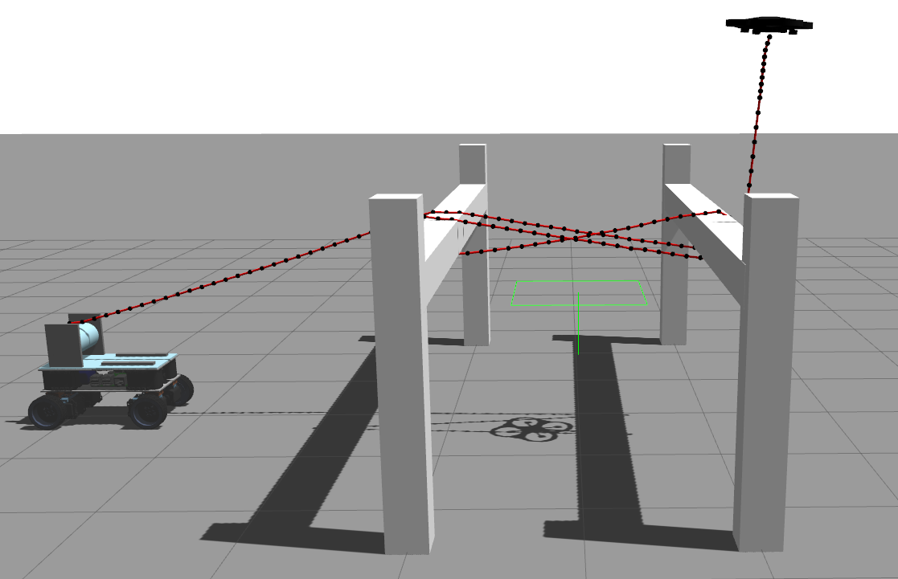
      <figcaption><strong>(b):</strong> Collision with a taut tether.</figcaption>
    </figure>
  </div>
  <p><strong>Figure 5:</strong> Examples of tether-obstacle collisions with varying degrees of tension.</p>
</div>

Beyond comparing the simulated tether to a theoretical catenary, we also conducted experiments to examine how it interacts with the environment. These tests were designed to confirm the simulator's ability to capture contact dynamics, including collisions with obstacles, wrapping around structures, and adjusting the tether's tension in response. Thus, <a href="#tether-collision-images">Figure 5a</a> illustrates a scenario where the tether remains slack while suspended between two obstacles. In contrast, <a href="#tether-collision-images">Figure 5b</a> shows the tether becoming entangled around both obstacles due to the UAV's trajectory, significantly increasing tension. These interactions influence the overall system behavior, affecting both the UAV's stability and the UGV's traction due to the dynamic forces exerted by the tether. This behavior can be better appreciated in the <a href="https://youtu.be/_j3KnPfFLBQ" target="_blank">accompanying video</a>.

The ability to simulate these contact events is essential for realistic modeling of marsupial robotic systems, as tether-environment interactions can introduce significant constraints in real-world applications. Our results demonstrate that the simulator correctly captures these effects, enabling detailed analysis of how tether dynamics impact system performance under various operational conditions.

### Simulated Scenarios

In the simulated scenarios, we focus on evaluating the fundamental functioning of the simulation framework and analyzing the dynamics of the UAV and UGV when following predefined trajectories. These are designed to cover a range of fundamental operational conditions, allowing us to calibrate the simulator and identify any issues in basic tether management and vehicle control.

<div id="simulated-scenarios" align="center">
    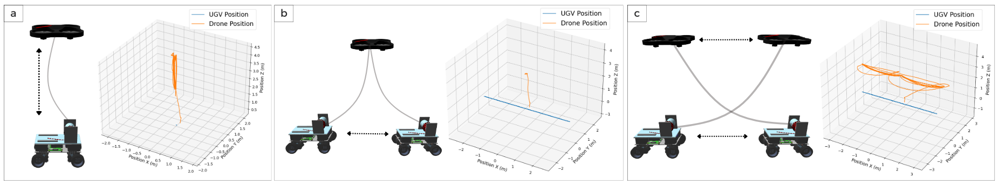
    <p><strong>Figure 6:</strong> Examples of the simulated scenarios used for validation.</p>
</div>

- **Scenario 1: Vertical Stability Assessment** (<a href="#simulated-scenarios">Figure 6a</a>): In this scenario, the UGV remains stationary while the UAV performs ten consecutive ascents and descents. The objective is to evaluate the winch's ability to smoothly release and retract the tether in response to vertical movements of the UAV. This scenario focuses on the stability of the UAV during tether length adjustments and the responsiveness of the winch control system.

- **Scenario 2: Horizontal Mobility Assessment** (<a href="#simulated-scenarios">Figure 6b</a>): The UAV hovers at a fixed altitude while the UGV moves back and forth between two points ten times. This scenario tests the tether's behavior during horizontal displacement of the UGV and examines the system's capability to manage tether slack without compromising the UAV's position stability.

- **Scenario 3: Opposite Direction Coordination** (<a href="#simulated-scenarios">Figure 6c</a>): In this scenario, both the UAV and UGV move simultaneously in opposite directions ten times. The aim is to challenge the system's coordination mechanisms and the winch's ability to adjust the tether length dynamically under increased complexity. This scenario simulates more intrincate movements that may occur in real-world operations where both units need to maneuver independently.

According to <a href="#simulated-test-metrics">Table III </a>, the UGV traveled significant distances in Scenarios 2 and 3, covering 49.99 meters and 50.88 meters, respectively. The UGV consistently adhered to the designated paths, exhibiting smooth and stable movements that reflect reliable ground dynamics.

In contrast, the UAV experienced minor perturbations in its flight path, particularly during complex maneuvers or when operating in close proximity to the UGV. These disturbances are primarily attributed to the complex dynamics of the tether. The interactions among the tether's elements introduce dynamic forces that influence the UAV's stability and control. The most significant perturbations occur when the UAV and UGV are very close to each other or aligned vertically, as the reduced spatial separation amplifies the interaction forces from the tether. This effect is evident in <a href="#simulated-scenarios">Figure 6c</a>, where the UAV's trajectory shows deviations during such configurations.

Notably, Scenario 3 resulted in the UAV traveling the greatest distance among the scenarios, covering 65.21 meters. The discrepancies between the UAV's actual path and the reference trajectory are further illustrated in Fig.~\ref{figure:test_position_ugv_uav}, which displays the UAV's and UGV's positions relative to their targets over time, highlighting slight oscillations due to the tether's influence.

<table id="simulated-test-metrics" style="width:80%; margin: auto; border-collapse: collapse;">
  <thead>
    <tr>
      <th style="text-align: center;">Scenario</th>
      <th style="text-align: center;">Simulation Time (s)</th>
      <th style="text-align: center;">Number of Targets</th>
      <th style="text-align: center;">Distance UAV (m)</th>
      <th style="text-align: center;">Distance UGV (m)</th>
      <th style="text-align: center;">Tether Released (m)</th>
      <th style="text-align: center;">Tether Collected (m)</th>
    </tr>
  </thead>
  <tbody>
    <tr>
      <td style="text-align: center;"><strong>1</strong></td>
      <td style="text-align: center;">504</td>
      <td style="text-align: center;">20</td>
      <td style="text-align: center;">45.50</td>
      <td style="text-align: center;">0.25</td>
      <td style="text-align: center;">23.64</td>
      <td style="text-align: center;">22.08</td>
    </tr>
    <tr>
      <td style="text-align: center;"><strong>2</strong></td>
      <td style="text-align: center;">765</td>
      <td style="text-align: center;">20</td>
      <td style="text-align: center;">6.99</td>
      <td style="text-align: center;">49.99</td>
      <td style="text-align: center;">14.09</td>
      <td style="text-align: center;">11.65</td>
    </tr>
    <tr>
      <td style="text-align: center;"><strong>3</strong></td>
      <td style="text-align: center;">803</td>
      <td style="text-align: center;">20</td>
      <td style="text-align: center;">65.21</td>
      <td style="text-align: center;">50.88</td>
      <td style="text-align: center;">40.11</td>
      <td style="text-align: center;">37.68</td>
    </tr>
  </tbody>
</table>

Specifically, the table reports key performance metrics: the simulation time (in seconds), the number of targets reached, the total distance traveled by the UAV and UGV (in meters), and the amount of tether released and collected (in meters) throughout the experiment


<div id="test-position-ugv-uav" align="center">
  <div style="display: flex; justify-content: center; gap: 20px;">
    <figure>
      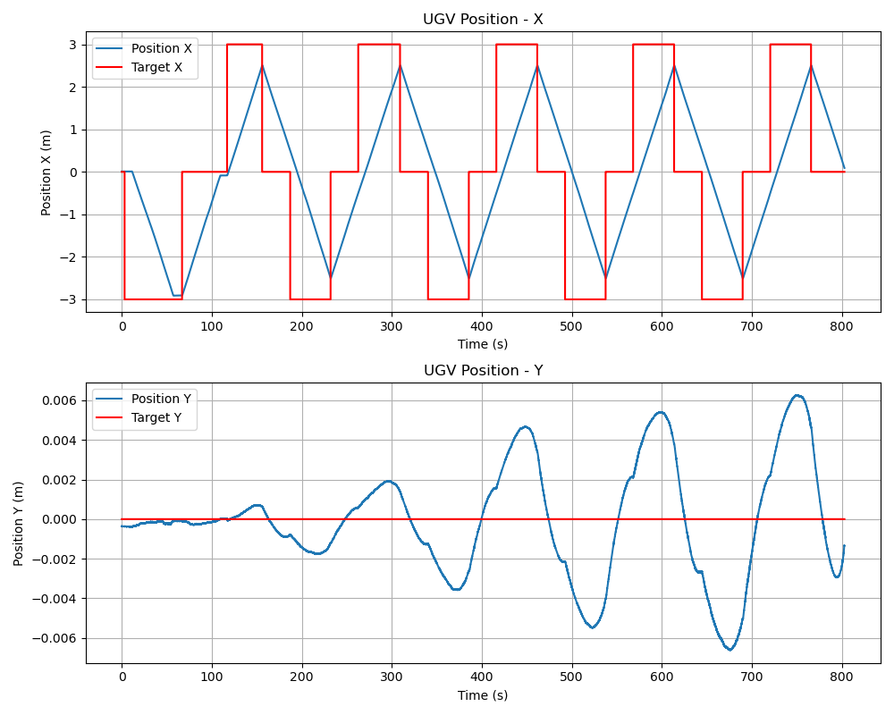
    </figure>
    <figure>
      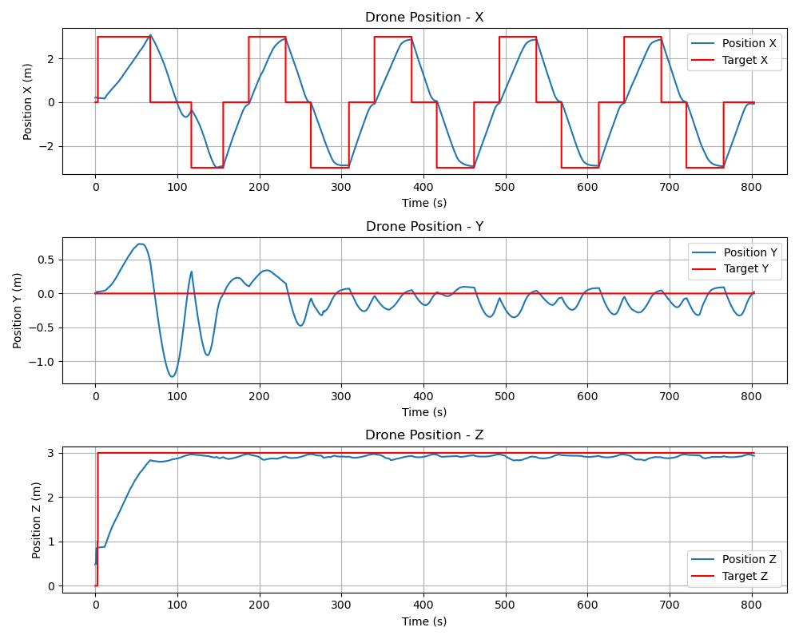
    </figure>
  </div>
  <p><strong>Figure 6:</strong> Visualization of the position of the UGV (left) and UAV (right) on each axis with respect to the reference in Scenario 3 (Opposite Direction Coordination). </p>
</div>

Despite these challenges, the UAV successfully reached all predefined target points across the stage, demonstrating the robustness of the control algorithms and the effectiveness of the tether management system. The control system effectively mitigated the disturbances induced by the tether, allowing the UAV to maintain its overall trajectory.

<a href="#test-tether">Fig. 7</a> depicts the tether length adjustments throughout the simulated scenario. The tether length is dynamically adjusted by the winch system to be 5\% greater than the relative distance between the UAV and UGV. This strategy ensures that the tether maintains slightly slack, preventing excessive tightness that might impact the UAV's stability. The tether length closely follows the target length, indicating the winch's responsiveness and the effectiveness of the tether management algorithms in real-time operation.

<div id="test-tether" align="center">
  <div style="display: flex; justify-content: center; gap: 20px;">
    <figure>
      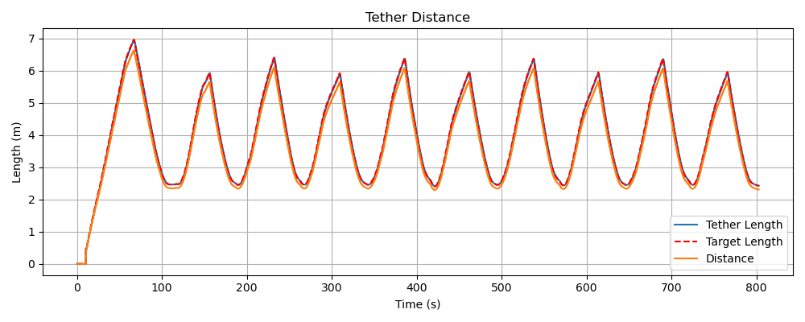
    </figure>
    <figure>
      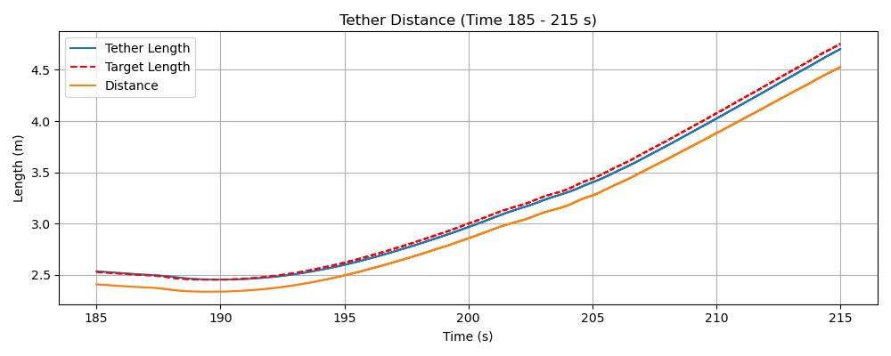
    </figure>
  </div>
  <p><strong>Figure 7:</strong> Tether length adjustments during Scenario 3, showing the evolution of the tether's actual length, target length, and distance between the UAV and UGV over time. </p>
</div>

Overall, the simulated scenarios confirm that while the tether introduces additional complexity into the UAV's dynamics, the system is capable of maintaining accurate trajectory tracking.

### Performance Evaluation

The computational performance of the simulator was evaluated to assess its real-time capabilities and scalability. All experiments were conducted on a laptop with 32 GB of RAM, a 13th Gen Intel Core i7-13620H (10 cores, 16 threads), and an NVIDIA GeForce RTX 4060 Laptop GPU. To analyze the impact of system components on simulation efficiency, a comparison was made with a more powerful desktop PC (64 GB RAM, 12th Gen Intel Core i9-12900F, and an NVIDIA GeForce RTX 3060 GPU). Each experiment was repeated 10 times, and since the mean deviation was negligible, the values correspond to the calculated averages.

<div id="performance-evaluation" align="center">
    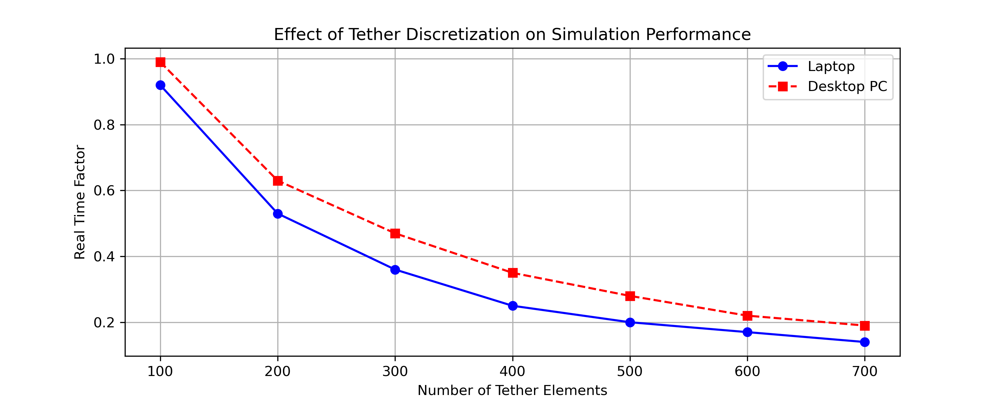
    <p><strong>Figure 8:</strong> Performance comparison between the laptop and desktop configurations. The real-time factor (RTF) is shown for tether element counts ranging from 100 to 700.</p>
</div>

As shown in <a href="#performance-evaluation">Fig. 8</a>, the desktop PC demonstrated superior performance. The number of tether elements directly influenced computational load. For the laptop, the real-time factor (RTF) decreased from 0.92 (100 elements) to 0.14 (700 elements), while the desktop PC maintained higher RTF values, ranging from 0.99 (100 elements) to 0.19 (700 elements), with a tether element length of 0.15 m in all cases. This divergence underscores the importance of system specifications for simulating high-fidelity tethered systems. Notably, the desktop achieved an RTF of 0.47 with 300 elements while the laptop required element counts below 200 to maintain RTF >0.50.

These results highlight the simulator's ability to run on mid-tier hardware while showcasing the benefits of higher-end systems for demanding simulations. As the number of tether elements increases, maintaining real-time performance becomes progressively more demanding. While the simulator remains functional across a range of systems, achieving high real-time factors, which is necessary if real-time execution is required, demands sufficient computational resources. Therefore, selecting the appropriate hardware is crucial to balancing simulation accuracy and computational feasibility in real-time applications.

<p align="right">(<a href="#readme-top">back to top</a>)</p>

## Installation

### Dependencies

This package has been designed and tested in an x86_64 machine under a Ubuntu 22.04 operating system and ROS2 Humble distribution. The following repositories are required for the implementation of the project:
  - sjtu_drone: (https://github.com/noshluk2/sjtu_drone/tree/ros2, branch: ros2)
  - gazebo_ros_link_attacher: (https://github.com/davidorchansky/gazebo_ros_link_attacher, branch: humble-devel)

### Build Instructions


1. Clone this repository into the `src` directory of your `colcon` workspace. 

2. Clones the required dependencies into the `src` directory.

3. Finally compile your workspace using ```colcon build``` 

<p align="right">(<a href="#readme-top">back to top</a>)</p>

<!-- USAGE EXAMPLES -->
## Usage
Six scenarios with different features can be set to use the optimizer. S1: Open environment, S2: Narrow/constrained environment, S3: Confined environment, S5: Open environment, S6: Confined environment, S7: Open environment, as shown in the next figure.

<div align="center">
  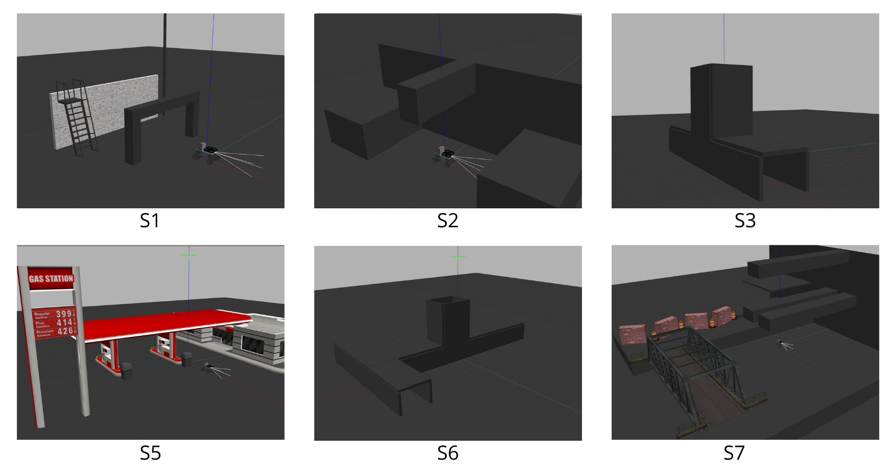
</div>

An extra scenario has been included to replicate the trajectory tracking experiment in a theatre conducted for the Path and Trajectory paper. Uncomment the ```spawn theatre``` line in the ```marsupial_simulation.launch.py``` file to see the theatre model (This can noticeably slow down the simulation on older hardware.). 

<div align="center">
  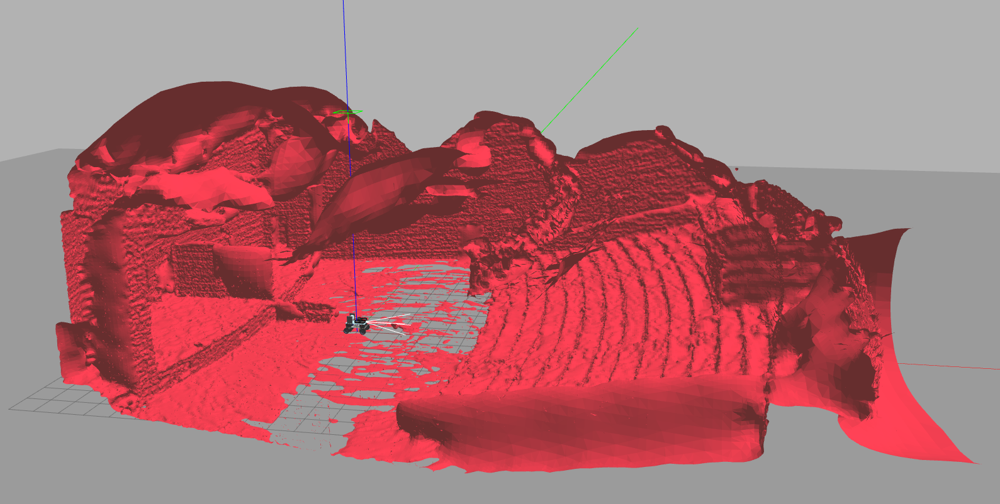
</div>

The package has a set of predefined configurations (and completely extendable according to the user's need) that relate to the stage number and initial position number. 


### Manual control
To launch the marsupial system in manual mode just launch the file `launch/marsupial_manual_simulation.launch.py`. The control of the ugv can be done using a remote control (default option) or the keyboard. The uav is controlled by the teleop option. To manage the scenario and initial position predefined is recommended to use the parameters for this launch, `world` and `pos_x`, `pos_y`, `pos_z`. Thus, for example, to use S5 and initial position (3, 1, 0):
1. Launch of the gazebo environment:
    ```bash
    ros2 launch marsupial_simulator_ros2 marsupial_manual_simulation.launch.py world:=stage_5.world pos_x:=3 pos_y:=1 pos_z:=0
    ```
2. In order to control the drone it is necessary to send a message for take-off:
    ```bash
    ros2 topic pub /sjtu_drone/takeoff std_msgs/msg/Empty {} --once
    ```
3. Landing message:
    ```bash
    ros2 topic pub /sjtu_drone/land std_msgs/msg/Empty {} --once
    ```

### Automatic control
To launch the marsupial system in automatic mode just launch the file `launch/marsupial_simulation.launch.py`. To manage the scenario and initial position predefined is recommended to use the parameters for this launch, `world` and `pos_x`, `pos_y`, `pos_z`. Thus, for example, to use S5 and initial position (3, 1, 0):
1. Launch of the gazebo environment:
    ```bash
    ros2 launch marsupial_simulator_ros2 marsupial_simulation.launch.py world:=stage_5.world pos_x:=3 pos_y:=1 pos_z:=0
    ```
2. To start the movement to the defined point:
    ```bash
    ros2 launch marsupial_simulator_ros2 marsupial_to_point.launch.py uav_x:=1.0 uav_y:=2.0 uav_z:=7.0 ugv_x:=5.0 ugv_y:=3.0
    ```
3. To change the destination point during simulation:
    - UGV
      ```bash
      ros2 topic pub /target_position_ugv geometry_msgs/msg/Pose '{position: {x: 3.0, y: 2.0, z: 0.0}, orientation: {x: 0.0, y: 0.0, z: 0.0, w: 1.0}}' --once
      ```
    - UAV
      ```bash
      ros2 topic pub /target_position_uav geometry_msgs/msg/Pose '{position: {x: 3.0, y: 2.0, z: 7.0}, orientation: {x: 0.0, y: 0.0, z: 0.0, w: 1.0}}' --once
      ```
4. To record a bag:
    ```bash
    ros2 bag record /sjtu_drone/gt_pose /sjtu_drone/cmd_vel /ugv_gt_pose /forward_velocity_controller/commands /cable_length /target_position_uav /target_position_ugv /tether_positions
    ```


### Experiments
To replicate the experiments conducted just launch the file `launch/marsupial_simulation.launch.py` and `launch/marsupial_experiment.launch.py`. It is recommended to perform the experiments in the predefined scenario to increase the efficiency of the simulator.

1. Launch of the gazebo environment:
    ```bash
    ros2 launch marsupial_simulator_ros2 marsupial_simulation.launch.py
    ```
2. To start the experiment:
    ```bash
    ros2 launch marsupial_simulator_ros2 marsupial_experiment.launch.py mission:=test1
    ```
3. To record a bag: the bag is recorded automatically

The tests carried out are as follows:

- Test 1. The UGV is kept static. UAV ascends and descends N times.
- Test 2. The UAV is kept static. The UGV moves between two points N times.
- Test 3. UAV and UGV move in opposite directions N times.
- Test 4. The test performed inside a theatre mentioned in "Path and Trajectory Planning of a Tethered UAV-UGV Marsupial Robotic System" (https://ieeexplore.ieee.org/document/10207830) is replicated. The length of the tether is calculated as a function of the relative distance between the UAV and the UGV. The test is maintained up to the target point 100.
- Test 5. The test performed inside a theatre is replicated again. In this case, the length of the tether is provided by the test trajectory. The test is maintained up to the target point 100. 

<div align="center">
  
</div>

It is possible to modify the `self.tether_coef` value of the `ugv_theter_trajectory_follower.py` script to adjust the behaviour of the tether. The test0 is included for this purpose. This parameter should be changed between 0 and 1 until a realistic result is achieved. 

<p align="right">(<a href="#readme-top">back to top</a>)</p>


<!-- Customization -->
## Customization

### How to modify tether model

By adjusting these parameters, you can simulate different types of tethers and study their behavior under various conditions. The parameters of the tether connecting the UAV and UGV can be customized through a Jinja file. This file allows you to adjust various physical properties of the tether elements to better suit your simulation needs. 

1. Open the Jinja file located at `models > tether > tether.sdf.jinja`.

2. Adjust the values of the parameters as needed. To increase the size of the tether, it is recommended to focus on increasing the `number_elements` parameter. This will result in a longer tether composed of more segments.

3. Save the changes to the Jinja file.

4. Recompile your workspace if necessary to apply the changes to the simulation.

5. To implement the changes run:
    ```bash
    python3  ~/marsupial/src/marsupial_simulator_ros2/scripts/jinja_gen.py   ~/marsupial/src/marsupial_simulator_ros2/models/tether/tether.sdf.jinja ~/marsupial/src/marsupial_simulator_ros2/models/tether 
    ```

### How to include new scenarios

You can easily introduce additional scenarios in the simulator by creating or copying a Gazebo `.world` file and placing it in the appropriate directory. This allows you to customize the environment layout (e.g., obstacles, buildings) while preserving the marsupial UAV-UGV simulation functionalities. Follow these steps:

1. Copy the `.world` file into the `worlds` directory
    ```
    ~/marsupial/src/marsupial_simulator_ros2/worlds
    ```
    
2. Add required plugins
    In your .world file, make sure to include the essential plugins for octomap construction and link attachment, as shown below. Insert these lines inside the <world> tag:
    ```xml
    <world name="new:_world">

    <!-- World elements  -->

    <plugin name="gazebo_octomap" filename="libBuildOctomapPlugin.so"/>
    <plugin name="ros_link_attacher_plugin" filename="libgazebo_ros_link_attacher_plugin.so"/>

    </world>
    ```

<p align="right">(<a href="#readme-top">back to top</a>)</p>


## Cite this work

This simulator has been submitted to a journal and is currently under review. You can see the details in the following arXiv repository.

> J. E. Maese, F. Caballero, and L. Merino. "Physical simulation of Marsupial UAV-UGV Systems Connected by a Hanging Tether using Gazebo", available on [arXiv:2412.12776](https://arxiv.org/abs/2412.12776).

<br>

<sub>This work was partially supported by the INSERTION PID2021-127648OB-C31 and NORDIC TED2021-132476B-I00 projects, funded by MCIN/AEI/10.13039/501100011033 and the European Union NextGenerationEU/PRTR.</sub>

<div align="center">
  
</div>


<!-- MARKDOWN LINKS & IMAGES -->
<!-- https://www.markdownguide.org/basic-syntax/#reference-style-links -->
[contributors-shield]: https://img.shields.io/github/contributors/github_username/repo_name.svg?style=for-the-badge
[contributors-url]: https://github.com/JoseMaese
[forks-shield]: https://img.shields.io/github/forks/github_username/repo_name.svg?style=for-the-badge
[forks-url]: https://github.com/github_username/repo_name/network/members
[stars-shield]: https://img.shields.io/github/stars/github_username/repo_name.svg?style=for-the-badge
[stars-url]: https://github.com/github_username/repo_name/stargazers
[issues-shield]: https://img.shields.io/github/issues/github_username/repo_name.svg?style=for-the-badge
[issues-url]: https://github.com/github_username/repo_name/issues
[license-shield]: https://img.shields.io/github/license/github_username/repo_name.svg?style=for-the-badge
[license-url]: https://github.com/github_username/repo_name/blob/master/LICENSE.txt

<p align="right">(<a href="#readme-top">back to top</a>)</p>
